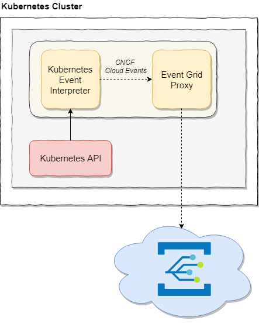

<h1 align="center">Kubernetes Event Bridge</h1>

A simple event bridge for Kubernetes native events

# Concept
Kubernetes Event Bridge will subscribe for events inside the Kubernetes cluster and forward CNCF Cloud Events to a sidecar of choice, in this case an Azure Event Grid proxy.

